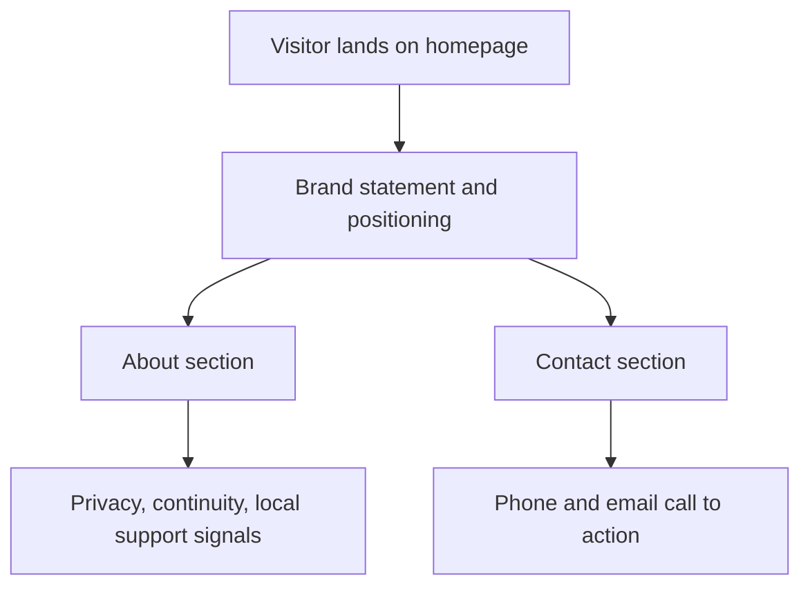

# feat: Build Praetor Home Systems Homepage

## Summary

Build a single-page marketing homepage for Praetor Home Systems LLC that introduces the business, explains its private digital-estate positioning for affluent households, and provides a clear contact path. The implementation should be lightweight to host on GitHub Pages, visually tailored to trust-sensitive clients and referral partners, and easy to maintain as a static site.

---

## Problem Frame

The target repository is essentially empty, so the work is greenfield. The homepage needs to communicate a high-trust residential service, not a hobbyist technology project. It should appeal to households and adjacent advisors who care about privacy, continuity, discretion, and white-glove support.

The user explicitly wants a simple homepage with an About section and a Contact section containing a phone number and email address. The strategy docs add important framing constraints: lead with privacy, control, continuity, and local support; avoid sounding like generic IT support or enthusiast self-hosting; and design for potential clients who expect professionalism and calm confidence.

---

## Requirements

- R1. The site is a single homepage that can be deployed easily on GitHub Pages.
- R2. The homepage includes an About section describing the business in language aligned with the strategy docs.
- R3. The homepage includes a Contact section with phone `661 645 5615` and email `info@praetorhomesystems.com`.
- R4. The visual design should feel premium, discreet, residential, and trustworthy for high-net-worth households and referral partners.
- R5. The implementation should avoid unnecessary framework complexity for a simple marketing page.
- R6. The repo should include a minimal deployment path and local preview/check workflow.

---

## Key Technical Decisions

- **Frameworkless static site:** Use plain `index.html`, `styles.css`, and a tiny optional `script.js` only if needed for minor interaction. This keeps GitHub Pages deployment trivial and avoids build-tool overhead for a one-page site.
- **High-trust editorial tone:** Copy should frame the offer as private family infrastructure and concierge support, echoing the strategy docs' emphasis on privacy, control, continuity, and local trust.
- **Premium residential visual language:** Use a restrained palette, generous spacing, strong typography, and subtle layered backgrounds to suggest bespoke home services rather than startup SaaS.
- **Minimal GitHub Pages workflow:** Add a Pages deployment workflow under `.github/workflows/` so the repo can deploy from source without manual branch publishing steps.
- **Container-first local preview:** Add a minimal container workflow for local preview and verification so the project stays compliant with the container-first guidance without introducing host-level installs.

---

## High-Level Technical Design



The page should read as a concise premium brochure: immediate positioning at the top, a grounded explanation of the service in the About section, and an easy way to contact the business without hunting through navigation.

---

## Output Structure

```text
.
├── .github/
│   └── workflows/
│       └── deploy.yml
├── Dockerfile
├── compose.yaml
├── README.md
├── index.html
├── styles.css
├── script.js
└── docs/
    └── plans/
        └── 2026-06-11-001-feat-praetor-homepage.md
```

`script.js` is optional and should remain very small or be omitted entirely if the final page does not need interaction.

---

## Implementation Units

### U1. Static Site Scaffold and Deployment Workflow

- **Goal:** Establish the static-site file structure, containerized local preview, and GitHub Pages deployment path.
- **Requirements:** R1, R5, R6
- **Dependencies:** None
- **Files:** `README.md`, `Dockerfile`, `compose.yaml`, `.github/workflows/deploy.yml`, `index.html`, `styles.css`
- **Approach:** Keep the repo source-driven and static. Add a minimal local preview command via container and a GitHub Actions workflow that deploys the site to Pages on pushes to the main branch.
- **Patterns to follow:** Favor direct static hosting conventions and low-ceremony repo setup over framework scaffolding.
- **Test scenarios:**
  - The site files render correctly when served locally from the container workflow.
  - The GitHub Actions workflow is syntactically valid and points at the static site source.
  - The repo README documents preview and deployment steps clearly.
- **Verification:** A local preview command serves the homepage, and the Pages workflow configuration matches a static-site deployment model.

### U2. Homepage Content and Information Architecture

- **Goal:** Write the homepage structure and copy for the hero, About section, and Contact section.
- **Requirements:** R2, R3, R4
- **Dependencies:** U1
- **Files:** `index.html`
- **Approach:** Structure the page as a single scrollable document with a strong opening statement, a concise About section, and a clearly visible Contact section containing the requested phone and email. Copy should speak to privacy-conscious homeowners and trusted advisors without sounding technical.
- **Execution note:** Preserve the strategy docs' language boundaries: do not lead with infrastructure jargon like servers, Docker, or homelabs.
- **Patterns to follow:** Use semantic HTML landmarks and accessible heading structure.
- **Test scenarios:**
  - The About section clearly explains what the business does in plain language.
  - The Contact section shows the exact phone number and email address with clickable links.
  - The page content remains readable and well-structured on mobile and desktop.
- **Verification:** A reviewer can identify the business offer, audience, and contact details in under a minute without needing additional pages.

### U3. Visual Design and Responsive Styling

- **Goal:** Create a polished responsive design that feels premium and residential rather than generic SaaS.
- **Requirements:** R4, R5
- **Dependencies:** U2
- **Files:** `styles.css`, `index.html`, `script.js`
- **Approach:** Use CSS custom properties, expressive typography, warm-neutral or architectural tones, layered background treatment, and careful spacing. Keep motion subtle and purposeful. Ensure layouts adapt cleanly from mobile to large screens.
- **Execution note:** Verify the visual result in a browser before considering the work complete.
- **Patterns to follow:** Preserve accessibility, strong contrast, and restrained animation.
- **Test scenarios:**
  - The layout remains legible and balanced at common mobile and desktop widths.
  - Buttons, links, and text contrast meet practical readability needs.
  - Styling reinforces a bespoke home-systems brand rather than a default template aesthetic.
- **Verification:** Browser review confirms the page feels intentional and polished on both mobile and desktop.

---

## Scope Boundaries

### In Scope

- One static homepage
- About and Contact sections
- Premium responsive visual design
- GitHub Pages deployment workflow
- Minimal containerized local preview

### Deferred to Follow-Up Work

- Cloudflare DNS or routing setup after deployment
- Additional pages such as services, FAQs, or consultation forms
- CMS integration
- Analytics, lead capture automation, or blog content

### Out of Scope

- Backend services or databases
- Complex JavaScript application behavior
- Bulk contact forms or automated outreach systems

---

## Verification

- Serve the site locally through the repo's container workflow and review it in a browser.
- Confirm the final HTML includes the requested About and Contact sections and exact contact details.
- Validate the GitHub Pages workflow configuration.
- Document deployment steps in `README.md`.

---

## Risks and Mitigations

- **Risk:** The page could drift into generic tech-brand language.
  - **Mitigation:** Ground copy and design choices in the strategy docs' privacy, continuity, and trust framing.
- **Risk:** Overengineering a simple site could make deployment and maintenance harder than necessary.
  - **Mitigation:** Stay frameworkless unless implementation uncovers a strong reason otherwise.
- **Risk:** GitHub Pages deployment can be confusing when workflow and repository settings are misaligned.
  - **Mitigation:** Prefer an explicit Pages workflow and document the remaining repository-side enablement steps in the README.
